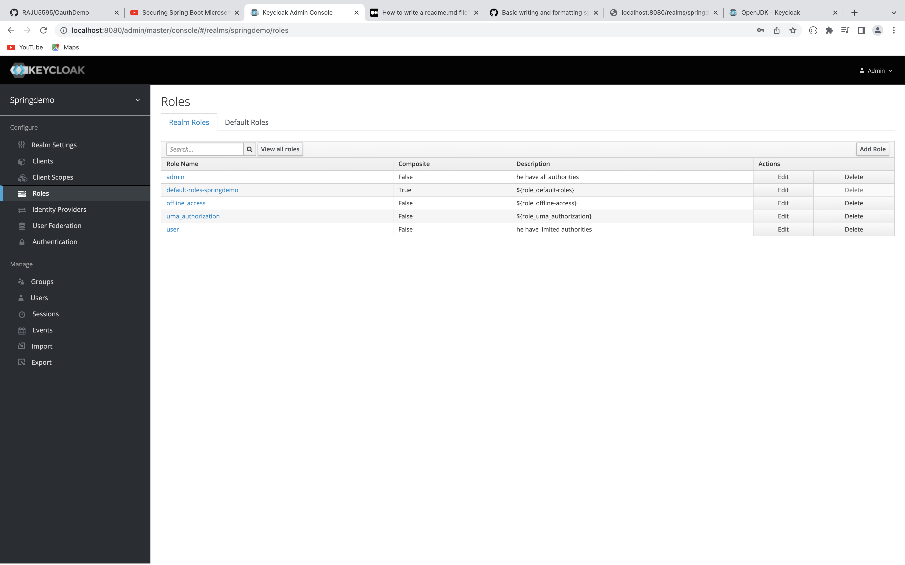
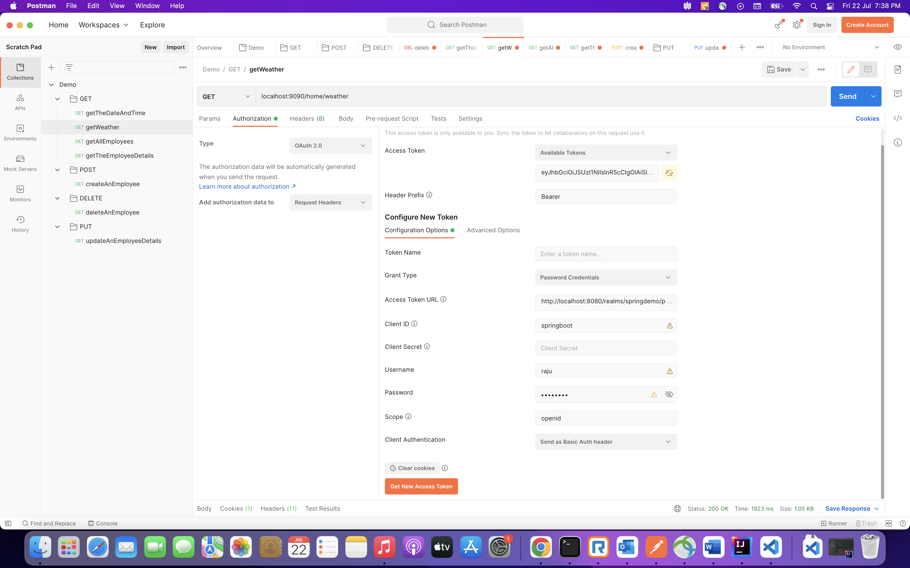
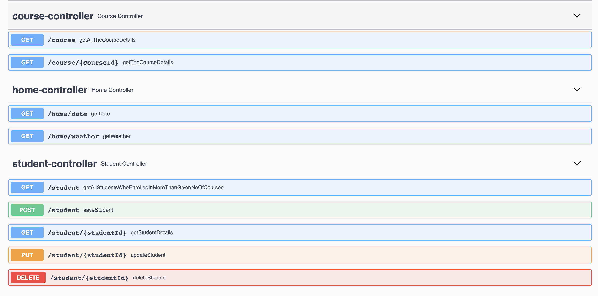

# Securing Spring Boot Application with Keycloak   

In this project I created end points and secured with my application KeyCloak Open Source Identity and Access Management.
 
## How to Run and Install  

Download and install Keycloak in the local machine.  
 * [Download Link](https://www.keycloak.org/downloads)  
 * To run keycloak follow these instructions https://www.keycloak.org/getting-started/getting-started-zip
### Important points to keep in mind :  

1.Create admin account.  
 * Keycloak does not come with a default admin user, which means before you can start using Keycloak you need to create an admin user.  

 * To do this open http://localhost:8080/, then fill in the form with your preferred username and password.  

2.Create Realm for our application. 
 * https://www.keycloak.org/getting-started/getting-started-zip#_create_a_realm  

3.Add Client to use Keycloak authourization server.  
 * https://www.keycloak.org/getting-started/getting-started-zip#_secure_your_first_app  

4.Create Roles.  
  

5.Create the Users and assign roles.  
 * https://www.keycloak.org/getting-started/getting-started-zip#_create_a_user

Since we are using openID, we need to add openID adaptor to our spring boot application.  

[Spring Boot adaptor](https://www.keycloak.org/docs/latest/securing_apps/#_spring_boot_adapter)

To generate an access token for Keycloak users, we have to use openID Endpoint Configuration in Realm Settings.  
 * http://localhost:8080/realms/springdemo/.well-known/openid-configuration

We can check that by using Postman Tool.  

**In Authorization we have to provide Access Token URL, Client ID , Scope ,Grant Type etc..**

  

Following are the end points given in the application. 
